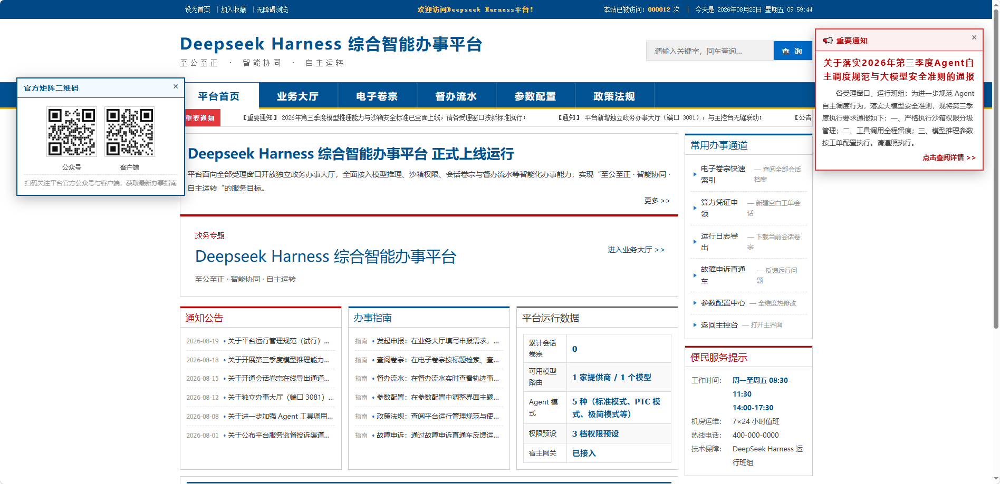
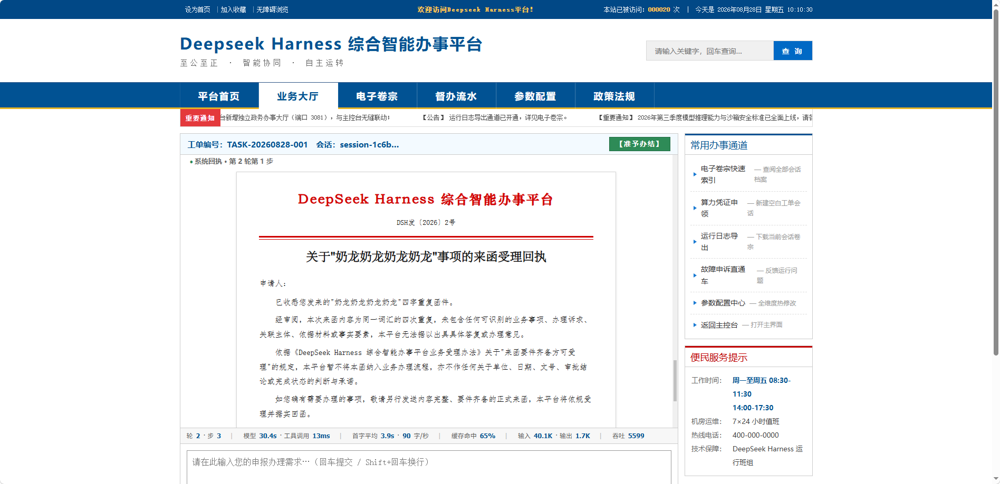

<div align="center">
  
  <h1>DeepSeek Harness 政务版</h1>
  <p>面向政务与机关办公场景的 DeepSeek Harness 社区插件包</p>
  <p>
    <a href="http://ff.urmpgo.cn"><strong>在线演示</strong></a>
    ·
    <a href="#快速开始">快速开始</a>
    ·
    <a href="#使用指南">使用指南</a>
    ·
    <a href="#安全与使用边界">安全边界</a>
  </p>
  <p>
    
    = 22.19" />
    
  </p>
</div>

> [!IMPORTANT]
> 这是非官方社区项目，不是 DeepSeek 官方产品，也不是政府官方网站。界面、模板与模型输出用于技术演示和辅助办公；正式公文、审批结果及公开发布内容必须由有权人员复核。

## 项目展示

### 平台首页

[](http://ff.urmpgo.cn)

首页集中展示通知公告、办事指南、运行数据、常用通道与动态信息窗口。

### 业务大厅与公文回执

[](http://ff.urmpgo.cn)

业务大厅把会话工单、流式回执、公文正文、模型耗时、Token 统计与常用办事通道组合在同一工作面。两张图均来自当前在线展示环境；点击图片或访问 **[http://ff.urmpgo.cn](http://ff.urmpgo.cn)** 可查看政务门户界面，演示站的可用性与后端能力以实际部署状态为准。

## 这是什么

本仓库把两个互补的 DeepSeek Harness（DSH）插件放在同一套可安装、可验证的开源目录中：

| 插件 | 作用 | 入口 |
| --- | --- | --- |
| [`dsh-gov-portal`](./plugins/dsh-gov-portal) | 独立政务风 WebUI，通过宿主 `apiProxy` 接入会话、模型、模式、权限、审批、统计与卷宗能力 | `http://127.0.0.1:3081/` |
| [`dsh-tool-hongtou`](./plugins/dsh-tool-hongtou) | 将当前会话整理为结构化提纲，再由确定性模板生成 Word 2003 XML 红头公文 | DSH 会话命令 `/hongtou` |

它不是 DeepSeek Harness 的完整发行版，也不替代 DSH 本体。你需要先有可运行的 DSH 环境，再把这两个插件挂载到 `web` profile。

## 核心能力

### 综合智能办事平台

- 经典政务门户布局：平台首页、业务大厅、电子卷宗、督办流水、参数配置与政策法规。
- 动态读取 DSH 的模型、推理强度、Agent preset 与权限预设，不在前端写死模型名称。
- 接收真实会话事件流，展示文本、思考、工具调用、审批请求、统计与轨迹。
- 支持会话索引、历史查阅、检索与 JSONL 导出。
- 前端零构建依赖；默认仅监听本机 `127.0.0.1:3081`。

### 红头公文生成

- 阶段一：从当前会话读取真实事件，由模型输出结构化 JSON 提纲。
- 阶段二：用确定性代码注入 Word 2003 XML 模板，控制标题、字号、行距、序号、红线与落款。
- 模型不可用或输出不合规时，回退到确定性提炼。
- 生成前执行 schema、占位符、Markdown 残留与 XML 合规检查。
- 默认附带示例内部文件章，可通过配置替换或关闭。

## 快速开始

### 环境要求

- Node.js `>= 22.19.0`；推荐使用 Node.js 24。
- 已安装并可启动的 DeepSeek Harness；本项目按 DSH `0.1.0-rc.6` 接口开发，其他版本可能需要适配。
- DSH 已配置可用的模型提供商与凭据。仓库本身不保存任何 API Key。
- Git 与 `dsh` 命令可在终端使用。

### 1. 克隆仓库

```bash
git clone https://github.com/Ramenne/DeepSeek-Harness-Gov.git
cd DeepSeek-Harness-Gov
```

### 2. 挂载两个插件

Windows PowerShell：

```powershell
$RepoDir = (Get-Location).Path
dsh plugin --profile web add "link:$RepoDir\plugins\dsh-gov-portal"
dsh plugin --profile web add "link:$RepoDir\plugins\dsh-tool-hongtou"
```

macOS / Linux：

```bash
repo_dir="$(pwd)"
dsh plugin --profile web add "link:${repo_dir}/plugins/dsh-gov-portal"
dsh plugin --profile web add "link:${repo_dir}/plugins/dsh-tool-hongtou"
```

插件命令会把依赖写入 `web` profile，并将 bundle 加入 `dsh.profile.bundles`。如果你的 DSH 版本不支持 `dsh plugin add`，可按下方方式手动配置。

<details>
<summary>手动配置 web profile</summary>

先把两个插件目录复制到：

```text
~/.dsh/plugins/dsh-gov-portal
~/.dsh/plugins/dsh-tool-hongtou
```

然后在 `~/.dsh/profiles/web/package.json` 中加入：

```json
{
  "dependencies": {
    "dsh-gov-portal": "link:../../plugins/dsh-gov-portal",
    "dsh-tool-hongtou": "link:../../plugins/dsh-tool-hongtou"
  },
  "dsh": {
    "profile": {
      "bundles": [
        "@deepseek-ai/dsh-base",
        "@deepseek-ai/dsh-web-app",
        "dsh-gov-portal",
        "dsh-tool-hongtou"
      ]
    }
  }
}
```

在 DSH 安装目录执行依赖安装或 reconcile，再重启 `dsh web`。

</details>

### 3. 启动

```bash
dsh web
```

启动后打开：

- 政务办事平台：<http://127.0.0.1:3081/>
- DeepSeek Harness 主控台：<http://127.0.0.1:3080/>

如果修改过插件代码或挂载配置，请重启 `dsh web`；前端静态资源修改通常刷新页面即可生效。

## 使用指南

### 使用政务办事平台

1. 打开 `http://127.0.0.1:3081/`。
2. 在业务大厅选择模型、推理强度、Agent 模式与权限预设。
3. 新建卷宗或打开已有会话，输入事项并提交。
4. 在回执区查看流式输出，在电子卷宗与督办流水中查看历史和轨迹。
5. 需要调整主题、公告、端口或界面文案时，进入参数配置。

插件服务端配置保存在 `~/.dsh/gov-portal.json`，浏览器界面配置保存在当前站点的 `localStorage`。监听端口等服务参数修改后需要重启 DSH。

### 生成红头公文

先在 DSH 会话中完成至少一轮对话，再输入：

```text
/hongtou
/hongtou 关于推进政务智能化建设的情况报告
```

生成文件会保存到当前 DSH 工作区的：

```text
output/红头公文_<事由>_<时间>.xml
```

该 XML 可由 Microsoft Word 打开。默认公章只是随项目提供的示例素材；正式使用前应替换为获授权的图章，或将 `HONDTOU_SEAL` 设为 `off` 关闭盖章。

## 本地验证

以下命令不会替代真实 DSH 环境验收，但可以验证源码、模板与本地桥接逻辑。

### 政务平台冒烟测试

```bash
cd plugins/dsh-gov-portal
node test/server-smoke.mjs
```

这项测试使用本地 mock `apiProxy`，验证静态资源、RPC、SSE、响应与导出桥；它不证明真实模型或真实账号已经可用。

### 红头公文测试

```bash
cd plugins/dsh-tool-hongtou
node --test --test-isolation=none \
  test/schema.test.js \
  test/phase1.test.js \
  test/phase2.test.js \
  test/e2e.test.js
```

真实对话检查需要先启动 DSH 与政务插件：

```bash
cd plugins/dsh-gov-portal
node test/e2e-chat.mjs
```

`e2e-chat.mjs` 会创建真实会话并使用模型额度，请只在你明确需要真实联调时运行。

## 目录结构

```text
DeepSeek-Harness-Gov/
├── README.md
├── LICENSE
├── docs/
│   └── assets/
│       ├── portal-overview.png
│       └── business-hall-document.png
└── plugins/
    ├── dsh-gov-portal/
    │   ├── lib/                 # 宿主插件与 API 桥
    │   ├── public/              # 无构建前端
    │   ├── docs/                # 设计与集成说明
    │   └── test/                # 冒烟、浏览器与真实联调检查
    └── dsh-tool-hongtou/
        ├── lib/                 # 提纲、清洗、回退与渲染
        ├── templates/           # Word 2003 XML 模板
        ├── assets/              # 示例公章素材
        └── test/                # schema、渲染与端到端测试
```

## 安全与使用边界

- **不要直接把 3081 端口暴露到公网。** 当前插件默认只监听 `127.0.0.1`；如需远程访问，应先增加身份验证、TLS、反向代理、最小权限与访问审计。
- 页面可选择 `danger-full-access` 等高权限预设。公开演示环境应禁用高权限写操作，避免连接含敏感数据的真实工作区。
- API Key、`.env`、DSH 会话、测试截图、备份和本地配置已由 `.gitignore` 排除；提交前仍应再次执行凭据扫描。
- AI 生成内容可能不准确。红头模板、公章图样和生成文本不代表任何机关签发，也不能代替法定审签流程。
- 在线演示只用于界面展示，不构成生产可用性、正式安全审计或政务系统验收证明。

## 参与贡献

欢迎通过 Issue 反馈兼容性、界面、模板和文档问题，也欢迎提交聚焦的 Pull Request。提交前请：

1. 不提交凭据、会话数据、本机绝对路径、内部域名或未经授权的公章素材。
2. 运行与改动直接相关的测试。
3. 在 PR 中区分本地 mock、真实 DSH 联调和正式部署证据。

## 许可证与致谢

本仓库采用 [MIT License](./LICENSE)。两个插件保留原有版权声明；`dsh-tool-hongtou` 亦有独立上游仓库 [`ExElectron/dsh-tool-hongtou`](https://github.com/ExElectron/dsh-tool-hongtou)。

DeepSeek、DeepSeek Harness 及其他相关名称和标识归其各自权利人所有。本项目与 DeepSeek 官方及任何政府机关无隶属或背书关系。
